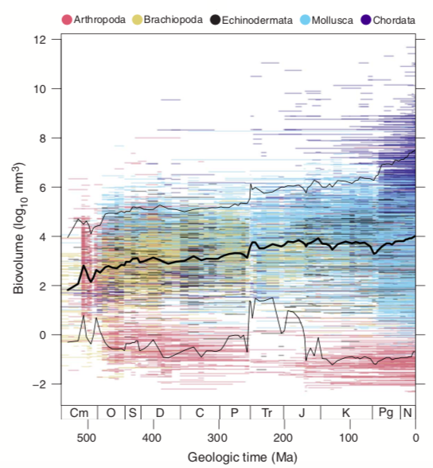
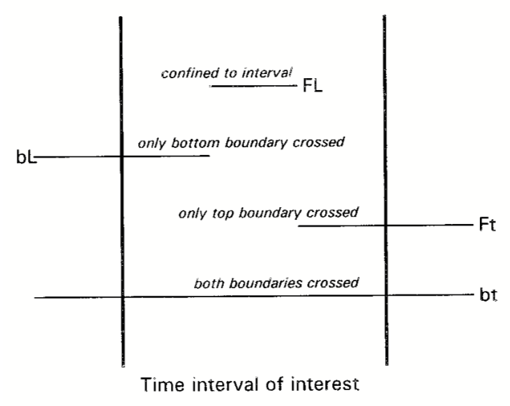

# Working with R, including manipulating large data frames to aggregate, summarize, and visualize data.

## Table of contents

* [Exercise Goals](#goals)

* [R Basics](#basics)

* [Writing Scripts](#writing)

* [Reading in the Dataset](#reading)

* [Writing Loops](#loops)

* [Stratigraphic Ranges](#stratData)

* [Making Your Plot](#makePlot)

* [Table and Apply Functions](#tableapply)

* [Additional Resources](#resources)

## <a name="goals"></a>Exercise Goals

The goal of this exercise is to become familiar using R with some practical examples that will be invaluable for your research project. By the end of the exercise you should know how to read in a data frame from a text file, use simple functions, log-transform your data, and generate a histogram. 

Specifically, you will reproduce Figure 1 from [Heim *et al.* (2015)](seyibExercises/ReadingExercises/papers/HeimEtAl2015.pdf). This figure depicts the size history of marine animals over the Phanerozoic. The x-axis is geologic time and the y-axis is the biovolume in units of log<sub>10</sub> mm^3 . The length of each horizontal line depicts the total stratigraphic range of each genus in the dataset and the position on the y-axes indicates size. The colors indicate the phylum to which each genus belongs



**Fig. 1. Body size evolution across the past 542 million years.** The distribution of fossil marine animal biovolumes across the Phanerozoic is shown. The colored horizontal lines show genus durations. The thick black line indicates the stage-level mean body size. The thin black lines demarcate the 5th and 95th percentiles. Cm, Cambrian; O, Ordovician; S, Silurian; D, Devonian; C, Carboniferous; P, Permian; Tr, Triassic; J, Jurassic; K, Cretaceous; Pg, Paleogene; N, Neogene.
## <a name="basics"></a>R Basics

There are several data types in R, and those data types can be stored in memory as several different object types. The three most common data types are intuitive to understand: numeric, character, logical. Numeric data are, as the name implies, numbers. The numbers can be integers, decimal numbers, and positive or negative. Unlike some other programming languages, R does not differentiate between different numeric types such as integers, floating point, etc. The easiest way to think of character data is as words. Most other programming languages refer to the character type as strings. Examples of characters are “a”, “what time is it”, and “56”. Note the use of quotes. When R displays character data to you, it will always be in quotes. So if you seen a number by itself in quotes, it is a character and not a number—as a consequence you can perform mathematical operations on it. Finally there is the logical data type. Logical data only indicates true and false. In other languages, this data type is frequently referred to as Boolean. There is also a common data type called a factor, but we’ll not worry about those for now.

Now that you understand the basic data types, let’s look at the types of objects R uses to store data. The four most common are scalars, vectors, matrices, and data frames. Let’s go through them one-by-one.

**Scalar**—Scalars store a single value, which can be one of several types. There are two ways to assign values to scalars (and the other data object types). You can either use an equals sign or a left-pointing arrow (<-). Although the equals sign is more familiar, I prefer the arrow. The convention in R is to use the equals sign only for assigning values to parameters within function calls, but you are free to use whichever notation you prefer. Below we assign the value of 7 to a scalar called x using both notations. Try it out. After you have assigned a value to your variable, type x to see that it returns the value you assigned.

````r
x <- 7 # arrow notation
x = 7 # equals sign notation
````

Working with scalars should be intuitive, and you can perform arithmetic on variables with numeric values. Below are some examples of simple mathematical operations using scalars.

````r
x <- 2
y <- 4
x * y # returns a value of 8
x / y # returns a value of 0.5
x^2 # this is squaring x, returns a value of 4
y + 8 # returns a value of 12
z <- x * y^3 # assigning z the value of x times the cube of y, 128
````

Note the use of the comment character (#) above. Everything on a single line (before you hit return) that appears after the # is not run by R. This is very useful for annotating you code so that you can quickly and easily remember what your code does, even after you haven’t looked at if for a long period of time. USE COMMENTS. It is also worth noting that R follows the order of operations—this is very important so review them if you have forgotten them.

The examples above are all of numeric types, but here are some examples to try with character and logical data types. 

````r
x <- "b" # this is a character variable
x <- "this is also a Character 56?*_wow"
````
Note that if you leave out the quotes, R will think b is a variable and you will get an error—unless you already have a data object called b, then R will assign x the value of b.

Logicals: Logicals, also called Booleans, are objects that have either a value of 'true' or 'false'. These are useful for comparisons. For example, is x greater than 12. The response will be a logical, or Boolean. 

````r
y <- TRUE # this is a logical with the value true
y <- T # this is also a logical with the value true
y <- t # this will not return an error, but it is also not a Boolean. t is the name given to the build-in transpose function, and you have made y a new object that is the transpose function; now you can use y() as you would t(). However, you should avoid using names already used by functions in base R or packages you are using. 

z <- FALSE # this is a logical with the value false
z <- F # this is also a logical with the value false
z <- f # this will return an error, unless f is a previously-defined object
````

Note that for logicals, you must use all caps and no quotes.

**Vectors**—Vectors are a series of values, all of the same type (i.e., numeric, character, logical) all stored in the same object. In fact, vectors are simply scalars with multiple values. In other programming languages they are often called arrays or one-dimensional arrays. If a vector is filled with numeric values, you can perform mathematical operations with it.

````r
x <- 3:9 # creates a vector with all the integers from 2 to 9, inclusive
x * 2 # multiplies every value in x by 2
````

In addition to performing arithmetic on a vector, we can also extract a certain subset of values using the square bracket notation ([]). For example, use the following to extract the 3<sup>rd</sup> value of x.

````r
x[3] # returns the 3rd value of x, which is a 5
````

**Matrices & Data Frames**—Matrices and data frames are both essentially tables. The main difference between a matrix and a data frame is that all the values of a matrix must be numeric while a data frame can have mixed data types. For this exercise, we will only be using data frames, so we will focus on them. You can think of a data frame as spreadsheet with rows and columns. And like in an Excel spreadsheet, you can give your rows and columns names. Column names are particularly helpful. Below we make a sample data frame and perform some basic operations for extracting specific subsets of data.

````r
# these lines make the data frame, called ‘d’
L3 <- LETTERS[1:3]
fac <- sample(L3, 10, replace = TRUE)
d <- data.frame(x = 1, y = 1:10, fac = fac)
````

The first thing you might want to do with this data frame is get some basic stats on it, like the number of rows and columns. To do this you can use the dim() function or run the nrow() and ncol() functions separately.

````r
dim(d) # returns the number of rows followed by the number of columns
nrow(d) # returns the number of rows
ncol(d) # returns the number of columns
````

Now that we know that d is a 10 x 3 data frame, we may want to extract subsets. The most basic subset would be to get the value of a single cell, let’s say the cell located at the 4th row, 2nd column. To get this cell we want to subset d using the square bracket notation. The square bracket notation with data frames (and matrices) is slightly different from how we used it with vectors. Because a data frame has rows and columns (i.e., it is two-dimensional), we need to supply two integers inside the square brackets separated by a comma. The number before the comma always specifies the row number and the comma after the comma always specifies the column number.

````r
d[4,2] # returns the value from the 4th row, 2nd column
d[2,4] # returns the value from the 2nd row, 4th column, which in this 
example is NULL because there are only 3 columns
````

To extract a single column of data from a data frame, use the dollar sign notation as follows: [data frame name]$[column name].

````r
d$x # returns the column named x as a vector
````

Extracting whole columns is easy; extracting rows is a bit more complicated. To extract rows we want to use the ``$`` notation within square brackets. Again, remember inside the square brackets we will specify the rows before the comma and the columns after the comma. In this first example, we will get all the columns so we do not need to specify anything after the comma—but we must include the comma.

````r
d[d$fac == 'B',] # returns only the rows of d with a value of ‘B’ in the fac column
````

Let’s deconstruct what we did here. The first term inside the square brackets is ``d$fac == 'B'``. What this means is to return all the rows where the value of the column named fac is equal to ’B’. If you have never learned a programming language, you may be asking why there are two quals signs. This is how we ask the question “is a variable equal to some value”. In this case we are asking if the values in the fac column are equal to ’B’. If we only included one equals sign, R would think we were trying to set the values of the fac column to ’B’. Since doing this inside square brackets doesn’t make sense, R returns an error. Try it out. There is nothing the the right of the comma because we want to get all the columns. If we only wanted the y and fac columns, we would use the following.

````r
d[d$fac == 'B', 2:3] # returns 2nd and 3rd columns from the rows of d with a value of 'B' in the fac column
````

**Simple Cross Plots**—Making a simple x-y plot in R is easy. 
Here is a simple example where we plot two vectors of random numbers. The basic idea is that you call ``plot`` then give it your x-axis values then your y-axis values. There are a bunch of other things you can do to customize you plot and make it more reader-friendly, but that's the gist. 

````r
myX <- rnorm(100) # a vector of 100 random numbers drawn from a normal distribution
myY <- rnorm(100) # another vector of 100 random numbers
plot(myX, myY) # generates a simple cross plot
````

Note the default behavior of the plot() function. The x- and y-axis labels are simply the variable names. The points are black open circles. These can all be customized. The axis labels are set with the xlab and ylab parameters and the point style and color are set with pch (point character) and col, respectively.

````r
plot(myX, myY, xlab="My x values", ylab="My y values", pch=16, col="blue") # generates a customized cross plot
````

My preferred plotting symbol is a solid circle: pch=16. However, there are 25 point characters you can choose from. Some point characters have a fill color, set with the bg parameter. Run the following code to see them all with the point outlines in blue and fills in red.

````r
plot(1:25, col="blue", bg="red", pch=1:25, cex=2, ylim=c(0,25))
text(x=1:25, y=0:24, labels=1:25) # adds labels below the points
````

### Variable questions:
1. Let's say you have a matrix named bestData. How would you get the value stored in the 7<sup>th</sup> column, 12<sup>th</sup> row?

2. Lets say you have a vector called beanHeights. It has 4 values, each representing the height of your bean plants in feet. You want to convert the heights to inches. How would you go about doing that with the shortest bit of code?

3. Lets say you also have a vector with 4 values called beanHeightsJune that has your bean plant heights from June. How would you go about calculating the June heights as a proportion of their heights today?


## <a name="writing"></a>Writing Scripts--Start of with Good Habits!
An absolute necessity for R to be a useful tool, is the construction of scripts. In the context computer languages, a script is a series of commands that can be executed in a program--in our case R. An R script is written and saved as a plain text file. When you are working on a problems set or research project, you should always construct a script. The benefit of a script is that it saves your work. Imagine you are working on a project that requires many steps: read in data, reformat data, run multiple statistical analyses, and finally construct one or more plots. A script keeps all of the relevant commands saved in one document so you can work on it later or come back another time to make modifications. Trust me, you don't want to spend time rewriting commands over and over every time you take a break from coding.

One of the most important aspects of writing a script is being diligent about writing comments. Remember comments are everything on a line that is written after a hashtag (`#`). Comments are a great way to leave notes for yourself and others on what each part of your script does.

A final tip on writing scripts is to keep them neat. A normal part of coding is trial and error to get some functions or processes to work properly. This is fine and adding new lines to your script as you do this is a fine practice. However, once you solve your problem, you should delete all the lines that do not work and leave yourself a detailed note explaining how your code works. Once you are finished writing a script, you should be able to run it and it should only produce the final output you're looking for--not all the errors and dead ends you made to get there.

To start a new script in R, follow *File > New Document* or click on the blank page icon.


## <a name="reading"></a>Reading in the Dataset

Now that you understand the basic data and object types along with some basic manipulations and plotting, you are ready to read in some real data. The dataset we will use is the marine animal body size data from Heim et al. (2015). The file is permanently stored at the Stanford Digital Repository, hosted by Stanford University Libraries. You can find and download the file at [http://purl.stanford.edu/rf761bx8302](http://purl.stanford.edu/rf761bx8302); the file you want is called *supplementary_data_file.txt* and is a tab-delimited file. Tab delimited files are a plain-text format, but structured like a spreadsheet with tabs separating each cell of the table. This is very similar to the more commonly used comma-separated files (csv). The file is approximately 2.3 Mb in size.

Once you have downloaded the file, save it to the working directory you will be using for this exercise. Open R and set the working directory to the one you are using for the exercise. You can set the working director in two ways. The first uses the keyboard shortcut cmmd-D (may be different in Windows), which will open a Finder window and you can navigate to your desired directory. The second method uses the setwd() function (see the section on functions in the Holland tutorial). In Mac and Windows, respectively, your command will look something similar to the following: 

````r
setwd("/path/to/my/directory") # Mac
setwd("c:/path/to/my/directory/") # Windows.
````

Once you set the working directory, you are ready to read in the file. To read in the file we are going to use the read.delim() function. This function reads in a tab-delimited file and stores it in your current R session as a data frame, if you assign it to a data object. So far in the examples, we have used simple single letter names for data objects (e.g., x, d). These names are not very informative, so I encourage you to give your data objects meaningful names. There are a couple of hare rules for data object names that you must follow. 1) never start an object name with a number: data3 is okay, 3data is not. 2) Do not include any spaces in the object name. 3) The only two special characters you can include are the period (.) and underscore (\_): ``my.data`` and ``my_data`` are good names, ``my/Data`` is not. Using multiple word object names is a fine practice and there are several ways you can do this. I suggest picking one and sticking with it throughout your code. The first is using what id called 'camel case', in which the first word is lower case and the first letter of all other words is upper case with no spaces, e.g., ``myNewData``. The second is using underscores as in ``my_new_data``. Finally you can use periods, which is as far as I can tell uniquely allowed by R, as in ``my.new.data. Again``, pick one format and stick with it. Some computer programmers have strong opinions about which format to use, but it is really a personal choice. Let’s read in the data file, which I will store in a data frame called sizeData.

````r
sizeData <- read.delim(file='supplementary_data_file.txt')
# Alternatively you can read the file in directly from the web
sizeData <- read.delim(file='https://stacks.stanford.edu/file/druid:rf761bx8302/supplementary_data_file.txt')
````

The first thing I always do after reading in a new dataset, is take a look at it to make sure it looks like it should. 

````r
dim(sizeData) # there are 17208 rows and 14 columns
head(sizeData)
````

You have already seen ``dim()``, but ``head()`` is also very useful. Because sizeData has more than 17,000 rows, if you were to just type sizeData, R would try to show you all 17,000+ rows. The head() function returns the first 6 rows only. This gives you a chance to make sure the column names were read in correctly and that the values of each column appear to be in the correct format. Take a few minutes to make sure you understand what the columns in the data frame are and how you might use them in constructing your plot.

You also need to read in a second tab-delimited file called *timescale.txt*. The file can be downloaded directly from GitHub: [https://raw.githubusercontent.com/naheim/rTutorials/master/dataFiles/timescale.txt](https://raw.githubusercontent.com/naheim/rTutorials/master/dataFiles/timescale.txt). Once you have read the file into R, use head to examine the types of information included in the data frame. Make sure you understand each column in the data frame.

````r
timescale <- read.delim(file='timescale.txt')
head(timescale)
# Alternatively you can read the file in directly from the web
timescale <- read.delim(file='https://raw.githubusercontent.com/naheim/paleosizePaper/master/rawDataFiles/timescale.txt')
````

### Data frame questions:
1. What is the column name for the size data you will plot?

2. What is the column name that indicates the time each genus goes extinct?

3. What is the column name that indicates the time each genus originated?


## <a name="loops"></a> Writing Loops

Loops are a programming tool that let you do the same calculation or set of calculations over and over again.  There are several types of loops, but we will use just the for loop.  It is simple and can do most tasks you’ll need.  In R the for loop has three basic parameters: a counting variable, a starting value and an ending value.  Here is a very simple loop that just prints the counting variable to your screen.  Run it to see what it does.

````r
for(i in 1:10) {
	print(i)
}
````

In the above code, ``i`` is the counting variable, 1 is the starting value and 10 is the ending value.  The loop starts by setting your counting variable equal to the stating value.  Next it does whatever you have put inside the curly braces, {}.  In the above example all we told the loop to do was print (to the screen) the counting variable.  Notice that it prints the actual number, not the letter i.  After it completes everything inside the curly braces it adds 1 to ``i``, then goes back to the top of the code inside the curly braces and performs it agin this time with the new value of i.  The loop stops when i equals the ending value and the code inside the curly braces is completed.  Notice the loop above stopped at 10 and did not print 11.

You can put whatever you want inside the curly braces of loop.  This is useful for calculating the same thing for different subsets of data.  For your research project, you will likely want to loop through the timescale to calculate things like the number of genera or mean body size within an interval.  Here is another very simple loop that goes through the geological time scale calculating the duration of each interval.

````r
# step 1: create a variable to save your results
durations <- vector(mode="numeric", length=nrow(timescale)) # note the use of nrow() to determine the vector length
for(i in 1:nrow(timescale)) { # set up the loop, again note the use of nrow() to determine how many times to loop
	durations[i] <- timescale$age_bottom[i] - timescale$age_top[i] # assign durations to our vector
}
````

Notice nothing was printed to the screen.  This is because we didn’t tell the loop to print anything.  To see if it worked, make a histogram of durations.  Does it look like the one you made yesterday?

````r
hist(durations)
````


## <a name="stratData"></a> Note on Working with Stratigraphic Ranges

Working with stratigraphic ranges can be tricky, mostly because you need to develop the logic for extracting the genera that are extant (or go extinct, or originate) during any given geological stage. This following explanation will be helpful in subsetting your body size data frame as you are loop through each of the 90+ geologic stages. The challenge is extracting only those genera that are extant in each interval. The figure below is useful in developing the necessary logic. The two vertical lines represent the boundaries of a time interval, with the oldest boundary on the left and the youngest on the right. The horizontal lines represent the 4 possible relationships between taxon ranges and time interval boundaries.

Here is some important terminology. The time that a taxon first appears in the fossil record is called its first appearance datum (FAD); the time of its extinction is called its last appearance datum (LAD). The column of FADs in the size data frame is called fad_age and the column for LADs is called lad_age. In timescale, the column for the age of the bottom of each interval is called age_bottom and the column for the tops of intervals is called age_top. The general logic we want for selecting the genera that exist in any arbitrary interval is as follows:

* Let’s call the interval we are interested in *i*.
* We want all genera with a *fad_age* that is older than the age_top of *i* 
* AND a *lad_age* that is younger than the age_bottom of *i*.

Now let’s convert this verbal logic into some R code! Remember, we will want to use the dollar sign-notation to retreive data from specific columns.

````r
sizeData[sizeData $fad_age > timescale$age_top[i] & sizeData $lad_age < timescale$age_bottom[i], ]
````



Now, convince yourself that this logic will select all genera within a time interval and none of the genera whose ranges are either entirely older or entirely younger than the interval. Refer to the above figure if you need, or draw your own.

## <a name="makePlot"></a>Making Your Plot

Your version of Figure 1 will be somewhat simplified compared to the published version. You should have the x-axis oriented in the proper direction (i.e., 550 Myr on the left and 0 Myr on the right—after all, we are paleobiologist and not geochemists!). Your x-axis will not have the boxes at the bottom with the geologic periods labeled—I made those with a function that I wrote. I’m happy to share the function, but it is not straightforward to use, so let’s put that off and just have a plain numeric axis. Additionally, in your first attempt at the plot you do not need to include colors for the different phyla. However, once you get your plot made and you have the time and motivations, see if you can figure out how to add the colors. I am not going to just give you the code to make the plots here. I want you to figure it out. To get you started, there are a few questions to ensure you understand the data frame, a list of general steps, and a list of functions that will be useful.

#### Some functions you will find useful
* ``mean()``
* ``plot()``
* ``segments()``
* ``lines()``
* ``sort()``
* ``quantile()``


### Steps for creating your plot.
Planning out your code is very important. Below I outline all the steps required to generate the plot. This is not code, but rather a plan for executing your code. Remember, most commands much be executed in the proper order. For example you can't plot your data until you have read in a data file. Writing out a list if steps in 'English' first and in the proper order, is key minimizing frustration in coding. Once you have you list, you can convert you English list to comments and start adding the actual code.

* Make sure you have read in the size data frame from the file called *supplementary\_data\_file.txt*.

* Make sure you have read in the timescale data frame from the file called *timescale.txt*. Make sure you understand what is in this data frame.

* Calculate the mean size of all animals in each of the geologic time interval (i.e., rows in the geologic timescale object you just read in). You will need to write a loop.

* Calculate the 5<sup>th</sup> and 95<sup>th</sup> percentile of genus sizes in each of the geologic time intervals. You can and should include this in same loop you use for the mean. The ``sort()`` or ``quantile()`` functions may be helpful.

* Open a plot window and set the x and y limits of the plot as well as the x and y axis labels. You may want to set ``type="n"``. The help file for plot.default may be helpful. To get a proper time axis you will want to set the xlim parameter.

* Plot horizontal lines for each genus. The position on the y-axis will correspond to the size of the genus, the starting position on the x-axis will correspond to the time of origination, and the end position will be the time of extinction. For a hint look up the help page for the ``segments()`` function. Considering the sizeData data frame, what are the vectors you will put into your code for the *x0*, *y0*, *x1* and *y1* parameters? 

* Add lines to your plot for the 5<sup>th</sup> size percentile, 95<sup>th</sup> size percentile, and mean size. You should probably make these lines a color other than black.


## <a name="tableapply"></a>Table & Apply Functions

Each rown in the dataset we are working with is a genus, and we might want group genera and aggregate or summarize properties of those groups. For simplicity, let's group our genera into Linnaean class then calculate some body size statistics for each class.

To do this we want to first create a base data frame that has one row for each class along with a column that indicates the phylum.

One way to do this is to use the ````unique()```` and ````match()```` functions. We will use ````match()```` to get extract the two columns, class & phylum, from sizeData and ````unique()```` to pair down sizeData to only include one row for each phylum-class combination. 

``match()`` Takes two parameters, the first is a vector of items to search for and the second is a vector of item to search in.  It then returns index values that match. Here's an example:

````r
myLetters <- c('N', 'A', 'H') # a vector of three letters to search for

match(myLetters, LETTERS)
````

In the above example ``LETTERS`` is a built in vector of all 26 capital letters. One way to 'read' the match call is that is returns the positions of ``myLetters`` in ``LETTERS``. Indeed that's what we see as the call returns 14, 1, and 18, which correspond to the positions of N, A, and H in the alphabet. Now we can use this function to select the phylum and class functions.

````r
# first look at the columns names of sizeData
colnames(sizeData)

# use match to get the positions of the columns of interest
match(c('phylum','class'), colnames(sizeData))

# we can actually just put this call into our bracket notation for making a new data frame called classes that only has class and phylum names
classes <- sizeData[,match(c('phylum','class'), colnames(sizeData))]
head(classes)

# this data frame has one row for every genus, so we can use the unique function to reduce it to only the unique phylum-class pairings.
classes <- unique(classes)
head(classes)

# To simplify the code we can actually combine the match and unique functons into the same line.
classes <- unique(sizeData[,match(c('phylum','class'), colnames(sizeData))])

# as a last step, we can eliminate the three rows where the class column is empty (these correspond to the genera whose class affiliation is unknown).
classes <- subset(classes, class != "")
````

Now that you we have all of the unique classes, we can attach to the data frame columns for mean, max and min sizes of each class as well as the number of genera in each class. We will use the ``apply()`` and ``tapply()`` functions to create vectors for each of these quantities, then use ``match()`` to make sure they are in the correct order as we attach them to the data frame.

The table function takes one parameter, either a string or factor, and it counts the number of times each value appears in the data set and returns a vector with named element.  This is what we will use to count the number of genera in each class.

````r
nGenera <- table(sizeData$class)
nGenera
names(nGenera)
````

Note that this created a vector of numeric values with names that correspond to the values of *class*, sorted alphabetically.  

We will now use the ``tapply()`` function to apply standard R functions to the dataset. ``tapply()`` takes three parameters. The first is the column that you want to apply a function to. The second is the column you want to group your values by. The third is the name of the function you want to use. The function returns a named vector of values, just like apply.  We will use ``tapply()`` below to calculate the mean, min, and max body size of each class.

````r
# applying the mean function to log10_volume grouped by class
meanSize <- tapply(sizeData$log10_volume, sizeData$class, mean)
meanSize

# now for min and max
maxSize <- tapply(sizeData$log10_volume, sizeData$class, max)
minSize <- tapply(sizeData$log10_volume, sizeData$class, min)
````

Finally we can attache these vectors to classes as new column. However it's important to note that the order of classes in the vectors we just made is different from the order in the classes data frame.  We will use ``match()`` to put them in the right order before attaching.

Adding new columns to data frame is easy.  You just need to write the new column names and set the value.

````r
classes$nGenera <- nGenera[match(classes$class, names(nGenera))] # here we created a new column 'nGenera' (I could have called it anything, but nGenera is descriptive) and assigned it values from the vector genus counts we created. Double check the new data frame with the nGenera vector to convince yourself it matched the values properly

# now we can do the same thing for the other vectors
classes$minSize <- minSize[match(classes$class, names(minSize))]
classes$meanSize <- meanSize[match(classes$class, names(meanSize))]
classes$maxSize <- maxSize[match(classes$class, names(maxSize))]

# now look at the new data frame with the added columns!!
classes
````
## <a name="resources"></a>Additional Resources

The built-in help function. To get help understanding a function, type a question mark followed by the function name.

````r
?mean # opens the help page for the mean() function
````
The R Website. [http://r-project.org](http://r-project.org).

R Studio. [https://www.rstudio.com](https://www.rstudio.com).

Holland, S.M. (2017). A Short R Tutorial. [http://strata.uga.edu/software/pdf/Rtutorial.pdf](http://strata.uga.edu/software/pdf/Rtutorial.pdf). [A great general introduction to R].

Zaffos, A. An Introduction to R. A great tutorial with quizzes created for the UW-Madison paleobiology course by Andrew Zaffos. [https://github.com/aazaff/startLearn.R](https://github.com/aazaff/startLearn.R)

R for Palaeontologists. A series of short R tutorials created by members of the UK-based Palaeontological Association (PalAss for short). [https://www.palass.org/publications/newsletter/r-palaeontologists](https://www.palass.org/publications/newsletter/r-palaeontologists).

~~Hunt, G. Data Analysis in Paleontology using R. [http://paleobiology.si.edu/staff/individuals/hunt.cfm](http://paleobiology.si.edu/staff/individuals/hunt.cfm). [Powerpoint slides from a course Gene teaches, a good introduction with paleontological examples].~~ Sadly this appears to have been disappeared from the Internet. :disappointed:

StackOverflow. [http://stackoverflow.com/questions/tagged/?tagnames=r](http://stackoverflow.com/questions/tagged/?tagnames=r). [A great resource for getting answers to your technical questions. Typing your question into Google frequently returns StackOverflow answers—it is the best online resource for specific questions].