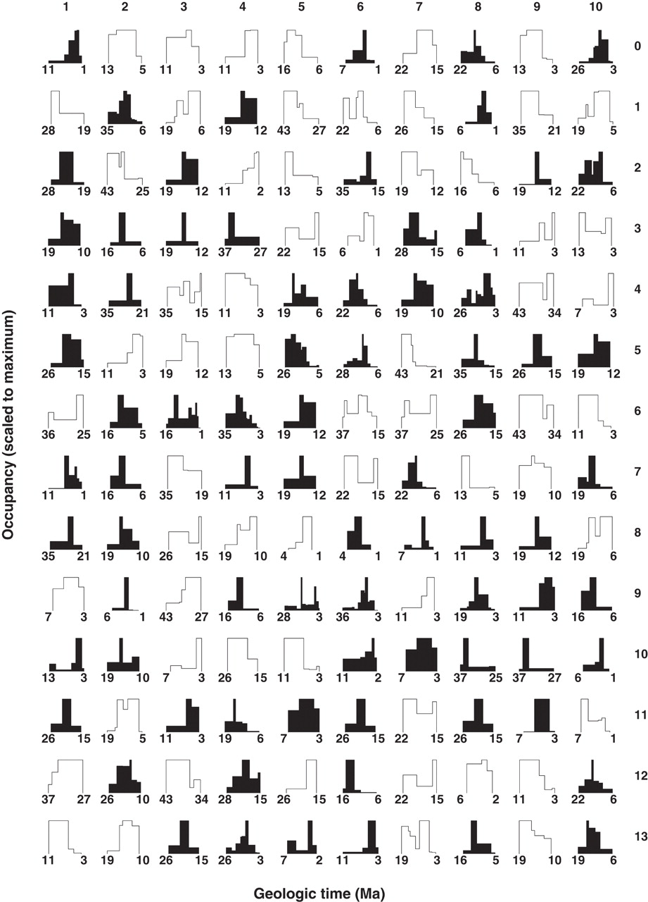
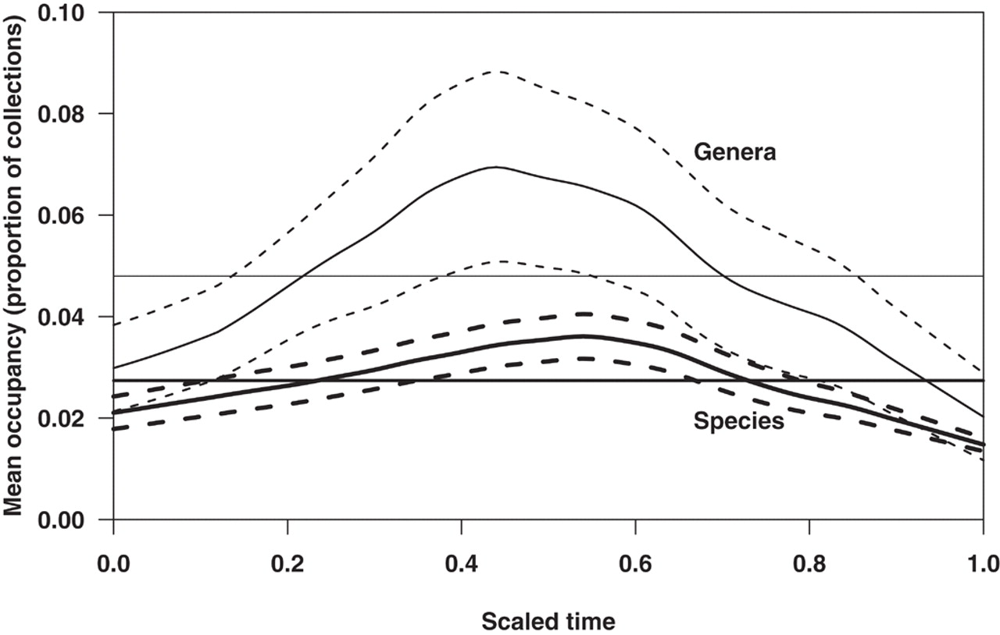

# Geographic Range Occupancy
The purpose of this tutorial is to demonstrate the calculation of geographic occupancy, as presented in [Foote et al. (2007)](http://doi.org/10.1126/science.1146303). Geographic occupancy describes history of geographic range size for a taxon, such as the genus *Gryphea*. By calculating the occupancy for many taxa, we can then start to make statistical comments about the temporal trajectories of taxa with respect to geographic rage. below is a figure from Foote et al. (2007) that show exemplar occupancy curves for several species of Cenozoic mollusks from New Zealand.


*"Empirical occupancy histories of Cenozoic molluscan species of New Zealand. Species are keyed to table S1; for example, species number 16 in table S1 is in row 1, column 6 in this figure. Durations are scaled to unit length from the base of the stage of first appearance to the top of the stage of last appearance, with the given numerical ages in millions of years ago (Ma) based on (27). Each occupancy history is scaled to its maximum. Species showing a relatively short-lived peak in occupancy away from the endpoints of the stratigraphic range are shaded."* Foote et al. (2007)

In this example, 130 species occupancy curves are given. Notice that the curves take a variety of shapes. Also notice that the width and maximum height of each curve are the same. This is because each curve is scaled to the maximum occupancy on the y-axis and to unit-length on the x-axis. In essence, both axes were converted to percentages. This scaling is crucial for being able to statistically aggregate the occupancy curves. 

After computing and scaling individual occupancy curves, we can then generate an average occupancy curve. This is done simply by summing the individual curves and dividing by the number of curves. Below are the average genus and species occupancy curves for Cenozoic Mollusks of New Zealand. Note that 1) the average curves have been smoothed and 2) that both genera and species tend to have their maximum geographic range near the middle of their durations.


*"Average occupancy history of Cenozoic molluscan species (thick curves) and genera (thin curves) of New Zealand, with durations scaled to unit length from the base of the stage of first appearance to the top of the stage of last appearance (27). The solid curves are the smoothed averages of the level of occupancy of all taxa at 100 evenly spaced, interpolated points between the times of first and last appearance (SOM). Dashed curves show 1 SE on either side of the average, as estimated from a bootstrap resampling procedure (SOM). The horizontal lines show the overall mean occupancy of all taxa over time."* Foote et al. (2007)


## Using the PBDB to calculate geographic range occupancy for Stenolaemata (Phylum: Bryozoa)

Before beginning our analysis, it's important to select the measure of geographic range. In paleobiological studies, there are number of commonly used metrics. Here we will use two to calculate two occupancy curves. The two metrics are maximum great circle distance and the number of occupied tectonic blocks.

**Maximum Great Circle Distance** Great circle distance is the shortest distance between two points on the surface of the sphere. For each genus in each stage, we will fine the maximum great distance between all pairs of occurrences. We will do this using the ``geosphere`` library, which assumes the sphere is the size of the Earth and returns distances in units of kilometers. We will, of course, use paleocoordinates by adding ``&show=paleoloc`` to the API call. 

**Number of Tectonic Blocks** The Earth's lithosphere is divided into a series of tectonic blocks that move relative to each other over geological time, though some are now sutured to other blocks and move as single larger blocks. The PBDB, returns the tectonic plate for each occurrence.

### Occupancy Code

```` r
library(geosphere)

# get Stenolaemata occurrences from PBDB
steno <- read.delim("https://paleobiodb.org/data1.2/occs/list.tsv?&base_name=Stenolaemata&idreso=lump_genus&show=class,paleoloc")

# it's important to drop occurrences where the paleolocations are unknown
steno <- droplevels(subset(steno, !is.na(paleolng)))

# Timescale excluding Pleistocene and Holocene
timescale <- read.delim("https://paleobiodb.org/data1.2/intervals/list.tsv?scale_level=5&min_ma=2.588")
nBins <- nrow(timescale)

# generate data frame for genus-level information
# FAD, LAD, nPalocont, nOccur 

# this is a simple custom function that will count the number of uniqe values in a vector
nUnique <- function(x) {return(length(unique(x)))}

# this is a custom function to calculate max great circle distance
maxGCD <- function(x) {
	require(geosphere)
	
	coords <- unique(x)
	distances <- apply(x, 1, distGeo, x)
	upperDist <- distances[lower.tri(distances, diag = FALSE)]
	
	return(max(upperDist))
}

# this is a custom function to identify NA values that are between non-NA values and set them equal to zero.
# this is needed to properly time scale the geographic occupancy
internalNAtoZero <- function(x) {
	NonNAindex <- which(!is.na(x)) # get non-na values
	firstNonNA <- min(NonNAindex) # find the index of the first non-NA
	lastNonNA <- max(NonNAindex) # find the index of the last non-NA
	
	tempRange <- x[firstNonNA:lastNonNA] # get full range, including NAs
	tempRange[is.na(tempRange)] <- 0 # change NAs within range to 0
	x[firstNonNA:lastNonNA] <- tempRange # reset values in original vector
	return(x)
}

#calc. individual parameters of interest
genus <- levels(steno$accepted_name)
fad <- tapply(steno$max_ma, steno$accepted_name, max)
lad <- tapply(steno$min_ma, steno$accepted_name, min)
nOccur <- as.numeric(table(steno$accepted_name))
nPaleocont <- tapply(steno$geoplate, steno$accepted_name, nUnique)

# stitch them all into a single data frame
genera <- data.frame(genus, fad, lad, nOccur, nPaleocont)
nGen <- nrow(genera)

# Set up data frames to hold geographic range values for each genus in each Phanerozoic stage
paleoCont <- data.frame(matrix(NA, nrow=nBins, ncol=nGen, dimnames=list(timescale$interval_name, genera$genus)))
greatCirc <- paleoCont # can set equal to paleoCont because we haven't filled in any values yet.


# calculate geographic range 
# the easiest, though not fastest in terms of computational time, is to set up a loop though each time interval, the use apply functions to calculate geographic ranges
for(i in 1:nBins) {
	# get occurrences from time interval
	tempOccur <- steno[steno$max_ma > timescale$min_ma[i] & steno$min_ma < timescale$max_ma[i],]
	
	#tabulate the number of unique paleocontinents for each genus
	paleoCont[i,] <- tapply(tempOccur$geoplate, tempOccur$accepted_name, nUnique)
	
	#tabulate the great circle distance for each
	#but first drop all genera that don't have at least three occurrences
	temp <- table(tempOccur$accepted_name)
	tempOccur <- tempOccur[is.element(tempOccur$accepted_name, names(temp[temp>=3])),] 
	greatCirc[i,] <- as.numeric(by(tempOccur[, match(c('paleolng','paleolat'), colnames(tempOccur))], tempOccur$accepted_name, maxGCD))
	
}

# remove genera that don't have any geographic ranges
# some don't have GCD ranges because the don't have any intervals with at least three occurrences
greatCirc <- greatCirc[, apply(greatCirc, 2, sum, na.rm=T) > 0]

# convert NAs within stratigraphic ranges to zeros
paleoCont <- apply(paleoCont, 2, internalNAtoZero) # apply function to columns
greatCirc <- apply(greatCirc, 2, internalNAtoZero) # apply function to columns

````

Now that we have out geographic ranges calculated two ways, we want to scale them in time and to the max occupancy. To do this we will set up two new Data frames. This time each will have 100 rows-each a cumulative percentage of the geographic range, and the number of columns will correspond to the number of genera. Each value in the data frames will range from 0 to 1, to represent a proportion of the maximum occupancy for each genus.

Once our new data frames are set up, we will loop through each genus, and scale the stratigraphic ranges to unit value (length of 1) and to the maximum occupancy (every occupancy is a proportion of the maximum).

````r
# set up two new data frames.
scaledPaleoCont <- matrix(NA, nrow=100, ncol=ncol(paleoCont), dimnames=list(1:100, colnames(paleoCont)))
scaledGCD <- matrix(NA, nrow=100, ncol=ncol(greatCirc), dimnames=list(1:100, colnames(greatCirc)))

for(i in 1:ncol(scaledPaleoCont)) {
	
}
````