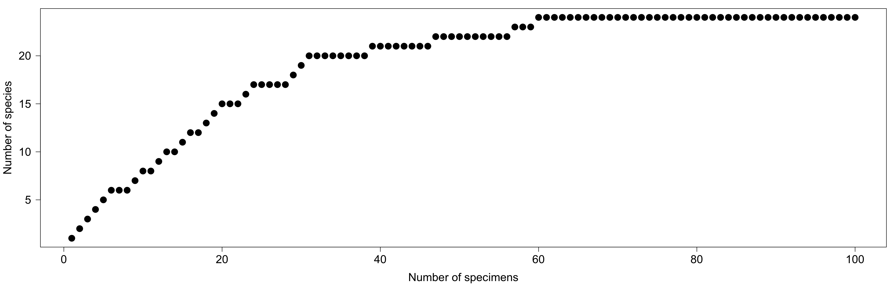

# Rarefaction

## Introduction
Sampling the fossil record is an important and necessary aspect of paleobiology. However, sampling is not always even which makes meaningful comparisons difficult. For a simple example, let's say you want to know which Late Ordovician formation has the most species: Kope or Liberty. You have a sample of the Kope Formation with 100 specimens and you are able to identify 20 species. From the Liberty formation, however, you have 200 specimens and have identified 30 species. Which formation really has more species. Taken at face value, the Liberty has more species, but the Liberty also has more specimens. Would the Kope have more than 30 species if you had an additional 100 specimens? Rarefaction can help answer this question. Rarefaction is a statistical technique for comparing the expected diversities of two or more samples if they had equal sample size. Rather than answering the question above (what if the Kope had more specimens), rarefaction answers the question "What if the Liberty Formation had only 100 specimens". Before we get to rarefaction, let's first consider the collector's curve.

## Collector's Curve
A collector's curve is used to tell if you've sampled enough specimens to adequately capture diversity. And as the name implies, is constructed as you are identifying and counting species in a sample by plotting the number of specimens you've identified on the x-axis and the cumulative number of species you've identified on the y-axis. After you've identified the first specimen, you have one specimen and one species--this is the first point on your collectors curve. If when you identify your second specimen, it's the same species you have two specimens and one species--the second point is (2,1). If your third specimen is a new species (different from the species of the first two specimens) you now have three specimens and two species--the third point is plotted at (3,2). Continue in this manner until you've identified all your specimens and you've constructed a collector's curve. Below is an example with simulated data.



```` r
library(vegan) # package developed by plant ecologists

# get all Carboniferous brachiopods with abundance counts
ozarks <- read.delim(file="https://paleobiodb.org/data1.2/occs/list.tsv?base_name=Brachiopoda&interval=Carboniferous&show=loc,class,abund&abundance=count")

# limit to only those from Heim (2009), which are from the Ozarks (reference_id = 26838)
# separate into two data frame, one for the Chesterian (latest Mississippian) and one for the Morrowan (earliest Pennsylvanian)
chester <- droplevels(subset(ozarks, early_interval == 'Chesterian' & reference_no == 26838))
morrow <- droplevels(subset(ozarks, early_interval == 'Morrowan' & reference_no == 26838))

# use table to make a sample by taxon community matrix, then convert to a data frame
chesterComm <- as.data.frame.matrix(table(chester$collection_no, chester$accepted_name))
morrowComm <- as.data.frame.matrix(table(morrow$collection_no, morrow$accepted_name))


````

#### Exercise Questions 2
 1. How many genera are there in the Chesterian community matrix? How many in the Morrowan?
 2. How many collections/samples are there in the Chesterian community matrix? How many in the Morrowan?