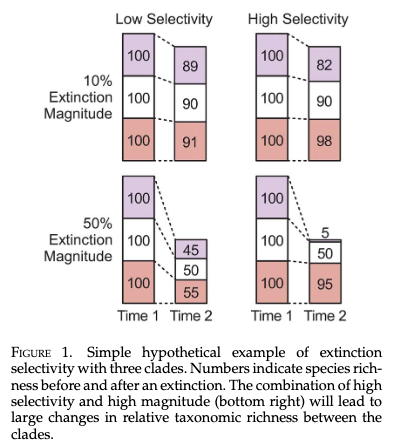
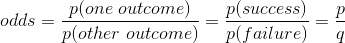
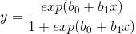
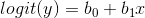

# EXTINCTION SELECTIVITY
Much of the reserach and writing that have been done about extinction have focused on the magnitude of extinction—that is the number or precentage of species that go extinct. Another aspect of extintion that paleontologists and conservation biologists want to explore is extinction *selectivity*. Selectivity refers to systematic differences between species that go extinct and those that survive. Selectivity is important because is potentially related to ecological change. 

Consider, for example, a hypothetical rocky intertidal zone with 35 species with the following distribution among trophic levels: 20 species of primary producers, 10 species of grazers, and 5 species of predators. Let's now assume that the intertidal zone experiences an extinction magnitude of 20% (total loss of 7 species). If the extinction had no selectivity with respect to trophic level, then we would lose 4 primary producers, 2 grazers, and 1 predator. Though this is an important loss of species, the relative diversity of each trophic level has remained unchanged; it's possible that the ecological impact of this extinction would be minimal. Now lets consider an extinction where all 5 predators are lost along with one grazer and one primary producer. The extinction magnitude is the still 20% or 7 species, but the selectivity is quite high with predators being much harder hit than the other two tropic levels. Moreover, it is easy to imagine that the post-extinction community is quite ecologically different. 

The figure below (Bush et al. 2020. *Paleobiology* 46:1–22) illustrates how extinction magnitude and selectivity combine to produce diferent post-extinctoin assemablages. Note that extinction selectivity could be measured against any number of factors. The common factors used for invertebrate paleontology include higher taxonomy, body size, feeding mode, and motility level, though any factor or combination of factors could be used. Also keep in mind that an extinction event might be selective with resprect to some factors but not others. 



In this tutorial we'll explore two different ways of measureing extinction selectivity and for both we'll use body size as the factor we're measuring selectivity against. The two methods are comparing mean values of victims and survivors using a t-test and logistic regression. We'll start with the former, because it's simpler.

# Victims vs. Survivors
If an extinction even is not selective with repsect to body size, then we would expect that the average size of victims and the average size of survivors would be the same (i.e., their difference would be zero). However, if the extinction were selective we would expect the difference in mean sizes to be either smaller or larger than zero. It turns out that calculate the difference between two means with confidence intervals is pretty striaght forward. We will use a t-test.

In the following dicussion and analyses, we will be considering selectivity in terms of the size of victims. This means that when we compute differences in mean size, we will always be subtracting survivors from victims (V - S). Thus, when the difference is positive, it means that victims were larger than survivors and when the difference is negatime, it means that the victims were smaller than survivors. As long as you're consistent, there is no reason you couldn't switch it around, but we're doing it this way. 

### Read in the data
We will use the body size data of Heim et al. (2015) that we've used so often in these tutorials. 

```` r
# read in size and timescale data files
sizeData <- read.delim(file='https://stacks.stanford.edu/file/druid:rf761bx8302/supplementary_data_file.txt')
head(sizeData) # look at your data to make sure it looks like you expect

timescale <- read.delim(file='https://raw.githubusercontent.com/naheim/paleosizePaper/master/rawDataFiles/timescale.txt')
# for this analysis, we're going to drop the Pleistocene and Holocene, because they are very short intervals and don't have a lot of extinction. It'll just make life easier.
timescale <- droplevels(subset(timescale, age_bottom >= 3.6))
head(timescale) # look at your data to make sure it looks like you expect
nBins <- nrow(timescale) # number of time intevals


````

### Set up variables and construct loop to calculate mean sizes
```` r
# set up data frame for storing results
selectivity <- data.frame(int_name=timescale$interval_name, age_mid=timescale$age_mid, mean_diff=NA, ci_minus=NA, ci_plus=NA, p_value=NA)

#set up loop
for(i in 1:nBins) {
	victims <- subset(sizeData, lad_age >= timescale$age_top[i] & lad_age < timescale$age_bottom[i]) #genera whose LAD is within the i-th interval
	survivors <- subset(sizeData, lad_age < timescale$age_top[i] & fad_age > timescale$age_top[i]) #genera whose LAD is younger than the i-th interval and FAD is within or older than the i-th interval
	
	# the t-test
	# notice the order of victims and surviors
	# also notice that you don't need to calculate the mean, the function will do it for you
	# for sample size reasons, we will only calcualte selectivity if there are at least 5 victims and 5 survivors.
	if(nrow(victims) >= 5 & nrow(survivors) >= 5) { 
		ttest <- t.test(victims$log10_volume, survivors $log10_volume)
		
		selectivity$mean_diff[i] <- ttest$estimate[1] - ttest$estimate[2]
		selectivity$ci_minus[i] <- ttest$conf.int[1]
		selectivity$ci_plus[i] <- ttest$conf.int[2]
		selectivity$p_value[i] <- ttest$p.value
	}
}
````

### Plot the data to see selectivity over time
The plot that we're going to make will have geological time on the x-axis and the mean differnce between victims and survivors (V - S) on the y-axis. There will be a dashed horzontal line at y = 0 to indicate no selectivity. Each point will the be average difference between victims and survivors with 95% confidence intervals. In general, we would say that if the confidence crosses the 0-line, that there was not significant selectivity during that interval. If a point and its confidence interval are above the 0-line, then we sould say that victims were significantly larger than survivors. If a point and its confidence interval are below the 0-line, then we sould say that victims were significantly smaller than survivors. 

```` r
quartz(height=7, width=10) # open up a rectangular window
par(las=1, pch=16) #set some basic parameters
plot(selectivity$age_mid, selectivity$mean_diff, xlim=c(541,0), ylim=range(c(selectivity$ci_plus, selectivity$ci_minus), na.rm=TRUE), xlab="Geological time (Ma)", ylab=expression(paste(Delta, " Mean body size (log"[10],"mm"^3,")"))) # the points, notice we used the confidernce intervals values to set the ylimits of the graph
segments(selectivity$age_mid, selectivity$ci_minus, selectivity$age_mid, selectivity$ci_plus, lwd=0.75) # the condidence intervals
abline(h=0, lty=2) # a horizontal line at y=0
````

Notice that selectivity varies over time, but that is becoms increasingly negative from the Late Cretaceous towards the recent, meaning that genera that have gone extinct during the last 100 million years have tended to be smaller than those that survive.

Using a simple t-test is a great way to explore basic selectivity patterns, but it has some limitations. A more sophisticated way of looking at extinction selectivity is with logistic regression.

# Logistic Regression
(some of this was borrowed from an online source, but I no longer remember what it was :flushed:. Appologies and thanks to the orgianl author of the text I've reused.)
## Odds, Odds Ratios, and Logit
When you go to Pinnacles National Park, how do you know if you'll see a California condor (*Gymnogyps californianus*)? You looked on a birding website and it givs the odds of seeing a condor in July from Pinnacles Campground. The odds are 1 to 8, which are the odds of seeing North America's largest bird. This means in nine visits to Pinnacles in July, you would expect to see a condor 1 time and not see one the other 8. In probability terms, the _probability_ of seeing a condor is 1/9, or 0.111. But the _odds_ of seeing a condor are 1/8, or 0.125. Odds are actually the ratio of two probabilities... 


<!-- https://www.codecogs.com/latex/eqneditor.php
\frac{p (one\ outcome)}{p(other\ outcome)}=\frac{p (success)}{p (failure)}=\frac{p}{q} -->

where *q = 1 - p*

So for our Pinnacles condor, odds(seeing) = (1/9)/(8/9) = 1/8. Notice that odds have these properties:

* If p(success) = p(failure), then odds(success) = 1 (or 1 to 1, or 1:1).
* If p(success) < p(failure), then odds(success) < 1.
* If p(success) > p(failure), then odds(success) > 1.
* Unlike probability, which cannot exceed 1, there is no upper bound on odds.

The natural log (i.e., ln or log<sub>e</sub>) of odds is called the logit, or logit transformation, of p: logit(p) = log<sub>e</sub>(p/q). Logit is sometimes called "log odds." Because of the properties of odds given in the list above, the logit has these properties:

* If odds(success) = 1, then logit(p) = 0.
* If odds(success) < 1, then logit(p) < 0.
* If odds(success) > 1, then logit(p) > 0.
* The logit transform fails if p = 0.

Logistic regression is a method for fitting a regression curve, y = f(x), when y consists of proportions or probabilities, or binary coded (0,1--failure,success) data. When the response is a binary (dichotomous) variable, and x is numerical, logistic regression fits a logistic curve to the relationship between x and y. The logistic curve looks like an S-shaped or sigmoid curve, often used to model population growth, survival from a disease, the spread of a disease (or something disease-like, such as a rumor), and so on. The logistic function is... 



<!-- y=\frac{exp(b_{0} + b_{1}x)}{1 + exp(b_{0} + b_{1}x)} -->

(N.B., exp(b<sub>0</sub> + b<sub>1</sub>x) = e<sup>b<sub>0</sub> + b<sub>1</sub>x</sup>; exp(3.45) = e<sup>3.45</sup> &cong; 2.718282<sup>3.45</sup> = 31.50039.)

Logistic regression fits b<sub>0</sub> and b<sub>1</sub>, the regression coefficients. It should have already struck you that this curve is not linear. However, the point of the logit transform is to make it linear... 



<!-- y=logit(y)=b_{0} + b_{1}x -->

Hence, logistic regression is linear regression on the logit transform of y, where y is the proportion (or probability) of success at each value of x. However, you should avoid the temptation to do a traditional least-squares regression at this point, as neither the normality nor the homoscedasticity (variance of points around regression line is uniform) assumption will be met.

Odds ratio might best be illustrated by returning to searching for condors at Pinnacles. Your birding website gives the odds of seeing a peregrine falcon (*Falco peregrinus*) of 1 to 2. This means that you are expected to see a peregrine falcon once in every three July visits to the park. The odds of seeing a peregrine falcon are 1/2, or 0.5. How much better is this than odds for seeing a California condor? The odds ratio tells us: 0.5 / 0.125 = 4.0. The odds of seeing a peregrine falcon are four times the odds of seeing a condor. Be careful not to say "times as likely to see," which would not be correct. The probability (likelihood, chance) of seeing a peregrine falcon is 1/3 and for a California condor is 1/9, resulting in a likelihood ratio of 3.0. You are only three times more likely to see a peregrine falcon than a California condor.


## Logistic Regression: One Numerical Predictor

**Now to Paleobiology**. Logistic regression acts on a binary response variable . A binary variable is one that that has only two outcomes. In our example here we will use extinction during the Maastrichtian stage as our predictor. This is binary repsonse because for all genera alive at some time during the Maastrichtian, they all either went extinct or they survived--there are only two possible outcomes. 

so here we want to use the logic of how *lad_age* is situated realtive to the time interval of interest to construct a new binary response variable called ``extinct``. Will set the value for extinct equal to 1 for genera that go extinct and equal to 0 for those genra that survive.

Load the data files the body sizes and the timescale (these are slightly different from the ones used above) and we'll perform a logistic regression of how well body size predicts going extinct at the end of the Cretaceous period. 

1) Read in data.

````r
# read in size and timescale data files
sizeData <- read.delim(file='https://raw.githubusercontent.com/naheim/paleosizePaper/master/rawDataFiles/bodySizes.txt')
timescale <- read.delim(file='https://raw.githubusercontent.com/naheim/paleosizePaper/master/rawDataFiles/timescale.txt')
nBins <- nrow(timescale)
````

2) Extract all genera alive during the *_Maastrichtian_*, the last stage of the Cretaceous Period.

````r
# subset data frame to get only genera alive at some time during the Maastrichtian
maasTime <- timescale[timescale$interval_name == 'Maastrichtian',]
maas <- subset(sizeData, fad_age > maasTime$age_top & lad_age < maasTime$age_bottom) # note the introduction of a new functino, subset()
````

Note that you can put as many arguments within the subset function to get the desired subset of data. In the situation here we used two arguements related to the extinction time. **Make sure you understand how these two arguements limit the occurrences to those that were alive sometime during the Maastrichtian.** It may help to draw a picture.

3) Add a new binary column for the Maastrichtian subset were genera tha survived the extincton have a value of ``0`` and genera that went extinct get a value of ``1``.

````r
# create a column that indicates taht a genus has gone extinct (1) or not (0)
maas$extinct <- 0 # this makes a new column called extinct and gives every element a value of 0
maas$extinct[maas$lad_age < maasTime$age_bottom & maas$lad_age >= maasTime$age_top] <- 1 # set thouse genera whose lad is within the Maastrichtian. Note the use of >=, which is "greater than or equal to".
````
**Once again, make sure you understand how these two arguements limit the occurrences to those that were went extinct during the Maastrichtian.**

4) Just to make things easier, let's make a new variable for log transformed size

````r
maas$logVolume <- log10(maas$max_vol)
````

5) Now thave you have a response variable, let's make a plot of extinction vs size in Maastrichtian aminals.

````r
plot(maas$logVolume, maas$extinct, xlab="log biovolume (cubic mm)", ylab="Extinction status", pch=16, col=rgb(0.2,0.2,0.2,0.4), cex=1.5)
````

6) Now let's perform the logistic regression.  This first step is to define our formula.  We could do this within the regression function itself, but it will make any editing easier if we make the formula as a separate variable.  Note that the formula is text wrapped in quotes.  In English, the formula is read "y is predicted by x" or in our case "extinction mode is predicted by size".

````r
glmEqn <-"extinct ~ logVolume" # these correspond to column names in maas.
````

We use the ``glm()`` [generalized linear model] function to perform the regression. To indicate that we're doing a logistic regression, we specify the family parameter as below.

````r
maasGlm <- glm(glmEqn, family="binomial", data=maas) # this runs the regression

summary(maasGlm) # view a summary of the results
````

The Summary function provides a summary of the regression output. The main part of the summary to pay attention to is the table called 'Coefficients'. You can view the coefficients on their own by calling" ``summary(maasGlm)$coefficients``. The first row in this table coresonds to the intercept of the logistic resion equation The intercept is analagous to the intercept of the standard linear regression equation, but doesn't have much practical interpretation so we'll ignore it. Instead we'll focus on the second row, which is the coefficient for body size (analagous to the slope in a standard linear equation). The coefficient is actually the log-odds associated with size. The log-odds for size in our example is 0.14088.

7) Now let's add the logistic regression to your plot.

````r
points(maas$logVolume, maasGlm$fitted, col="red", pch=16)
````

Recall that the response variable is log odds, so the coefficient of "logL" can be interpreted as *for every ten-fold increase in size, the odds of being extinct increases by exp(0.14088) = **1.15 times***!

## Logistic Regression: A Numerical & Categorical Predictor

Let's now add a feeding mode to our analysis to simultaneously consider the effects of size and whether or not a genus is a predator on the odds of extinction.  The feeding mode code for predators is 5.

````r
# first remove genera without a feeding mode
maas <- maas[!is.na(maas$feeding),]

# make new column for binary feeding mode (1 = predator; 0 = non-predator)
maas$pred <- 0 # set all values to 0
maas$pred[maas$feeding == 5] <- 1 # this changes our code to 1 for those that have feeding mode 5

# check out your new column
head(maas) 
table(maas$pred) # this counts the number of predators and non-predators

# Once again, we want to specify a regression equation, then run the regression.  
glm.eqn <-"extinct ~ logVolume + pred"

ext.glm <- glm(glm.eqn, family=binomial(logit), data=maas)

# Let's see what we have found... 
summary(ext.glm)

# Note that we can't easily plot these data because we would now need an plot with 3 axes.
````

### *p-values*
This shows that neither extinction predictor is *statistically significant*, but that being a predator has is probably a better predictor of extinction that size during the Maastrichtian. We judge *significance* using the *p-value*, which is given in the coefficients table with the column header "Pr(>|z|)". In our case logSize has a *p-value* of 0.3230 and pred has a *p-value* of 0.0799. By convention we say that coefficients with *p-value* <= 0.05 are statistically significant. In our case the pred coefficient has a *p-value* 0.08. This means that if the data were randomly shuffle the feeding modes among genera over and over again, we would expect to get the observed coefficient of 0.284995 about 8% of the time. Our *p-value* for predation is close to the arbitrary cut-off of 0.05 while the *p-value* for size is much farther away.

### Effects of multiple predictors
The most important aspect of the above two examples is the difference in the size coefficient between the two regressions. In the first examle, where we only considered the effects of size on extinction, the coefficient is 0.14088. However, when we include a second predictor, being predatory, the size coefficient decreased to -0.045326! Not only is the new coefficient closer to zero, it's the opposite sign. What does this mean?!

The negative coefficient in our second regression means that as size increases, the odds of going extinct in during the Maastrichtian decreses--smaller genera are more likely to go extinct! However, there are two other important aspects of this coefficeint to consider. First, this negative effect is very small. The coefficient is very close to zero (also note it's relatively large *p-value*). Secind, this coefficient is different from the coefficient from the regression with size only because now we are accounting for the effects of feeding mode. Most of the extinction selectivity is due to being a predator rather than be cause of size. The coeffient in the first regression was so much bigger because predators are larger than non-predators but regression didn't "know" who was a predator or not until we told it and included it in the regression!

Just for fun, let's make sure that predators are indeed larger than non-predators with a quick box-and-whisker plot. 

````r
boxplot(maas$logVolume ~ maas$pred, notch=TRUE, names=c("non-predators","predators"), las=1, ylab="log biovolume (cubic mm)")
````

In the above line, ``notch=TRUE`` adds the notches on the boxes, which indicate 95% confidence intervals on the mean. Because the notches of the two boxes do not overlap along the y-axis, we are more than 95% confidence the the median size of predators is larger than the median size of non-predators! Finally, ``las=1`` makes the y-axis numbers horizontal.

## Timeseries of extinction selectivity
Let's calculate the log-odds of extinction for body size and feeding mode simultaneously. We'll use the same glm equation used in the section above ``glm.eqn <-"extinct ~ logVolume + pred"``. We'll write a loop (as with the t-test) and store the log-odds for both body size and feeding mode in a data frame. Finally, we'll plot both sets of selectivity coefficients in seperate plots.

```` r
# we will use the master data frames we loaded above (timescale and sizeData). 
# we need to add the pred colum to the main sizeData data frame
# make new column for binary feeding mode (1 = predator; 0 = non-predator)
sizeData$pred <- 0 # set all values to 0
sizeData$pred[sizeData$feeding == 5] <- 1 # this changes our code to 1 for those that have feeding mode 5

# make new column with lo1g10-transformation of body size
sizeData$logVolume <- log10(sizeData$max_vol)

# the logistic equation (same as above)
glm.eqn <-"extinct ~ logVolume + pred"

# set up dataframe with results
extSelect <- data.frame(interval_name=timescale$interval_name, age_mid=timescale$age_mid, size_coef=NA, size_minus=NA, size_plus=NA, pred_coef=NA, pred_minus=NA, pred_plus=NA)

# loop througe each time interval
for(i in 1:(nBins-1)) { # i dropped the last time interval because it's value is anamolous
	# select taxa extant in i-th inteval
	tempTaxa <- subset(sizeData, fad_age > timescale$age_top[i] & lad_age < timescale$age_bottom[i])
	
	# now we need to identify and mark which taxa go extinct in this interval
	tempTaxa$extinct <- 0 # default to survivor
	tempTaxa$extinct[tempTaxa$lad_age >= timescale$age_top[i] & tempTaxa$lad_age < timescale$age_bottom[i]] <- 1 # change those that go extinct to a 1	
	# we can only run the regression if there are multiple victims and survivors
	# for sample-size reasons we'll only run the regression if there are 5 each
	if(sum(tempTaxa$extinct) >= 5 & nrow(tempTaxa) - sum(tempTaxa$extinct) >= 5) {
		# run regression
		tempGlm <- glm(glm.eqn, family=binomial(logit), data=tempTaxa)
		
		# calculate confidence intervals
		tempCi <- confint(tempGlm)
		
		# fill in dataframe
		extSelect$size_coef[i] <- tempGlm$coefficients[2] # look at tempGlm$coefficients to convince yourself that the size coefficient is the second value
		extSelect$size_minus[i] <- tempCi[2,1] # look at tempCi to convince yourself that the size lower confidince limit is in the second row, first column
		extSelect$size_plus[i] <- tempCi[2,2]
		
		extSelect$pred_coef[i] <- tempGlm$coefficients[3] 
		extSelect$pred_minus[i] <- tempCi[3,1] 
		extSelect$pred_plus[i] <- tempCi[3,2] 
	}
}

#####

YOU WILL GET SOME WARNINGS AND MESSAGES IN RED, YOU CAN IGNORE THEM

````
### Let's plot!

Here we'll set up a single plot windown with two panes, one on top of the other. The top pane will contain our results for the size selectivity and the bottom pane the results for feeding selectivity. We set this up by telling R to divide the plot window into a grid with two rows and one column. We do that by adding the following to *par()*: ``mfrow=c(2,1)``. When working with more than one pane in a plot window, R puts the first plot command in the first cell (1,1) the fills panes along each row from left to rignt before going to the next row down. To get R to start plotting in a new pane, all you need to do is call another plot function (e.g., *plot(), boxplot(), barplot()*). 

```` r
quartz(height=12, width=10) # open up a rectangular window
par(las=1, pch=16, mfrow=c(2,1)) #set some basic parameters, including the two panes

# size selectivity
plot(extSelect$age_mid, extSelect$size_coef, xlim=c(541,0), ylim=range(c(extSelect$size_minus, extSelect$size_plus), na.rm=TRUE), xlab="Geological time (Ma)", ylab="Log-odds of extinction (size)") # the points, notice we used the confidernce intervals values to set the y-limits of the graph
segments(extSelect$age_mid, extSelect$size_minus, extSelect$age_mid, extSelect$size_plus, lwd=0.75) # the condidence intervals
abline(h=0, lty=2) # a horizontal line at y=0

# feeding selectivity. notice by calling plot() again, we've started filling in the lower pane
plot(extSelect$age_mid, extSelect$pred_coef, xlim=c(541,0), ylim=range(c(extSelect$pred_minus, extSelect$pred_plus), na.rm=TRUE), xlab="Geological time (Ma)", ylab="Log-odds of extinction (feeding)") # the points, notice we used the confidernce intervals values to set the y-limits of the graph
segments(extSelect$age_mid, extSelect$pred_minus, extSelect$age_mid, extSelect$pred_plus, lwd=0.75) # the condidence intervals
abline(h=0, lty=2) # a horizontal line at y=0
```` 

## Bonus Section: Exploring The Logistic Function

In this section we will make a multi-panel plot that shows how the shape of the logistic curve changes as the difference between "success" and "failure" increases. In the 9 panels below, the 0 values are the same. In the middle panel the 0 and 1 values are the same. In the previous panels, the 1 values are *decreased* by a constant; in the following panesls, the 1 values are *incrased* by a constant.

````r
# This bock of code is not commented very well, but by now you should be able understand everything that's going on.
nPlots <- 9
quartz(height=8, width=8) # if using Windows, use 'window' instead of 'quartz'
par(mfrow=c(3,3), pch=16)
meanIncriments <- seq(-10, 10, length.out= nPlots)
myCols <- rainbow(nPlots) # rainbow() generated colors from the rainbow spectrum
my0 <-rnorm(100, mean=0, sd=4.5) # rnorm() generates random numbers taken from normal distribution with the specified mean and stadard deviation
for(i in 1:nPlots) {
	my1 <- my0 + meanIncriments[i]
	myGlm <- glm(rep(c(0,1),each=100) ~ c(my0, my1), family="binomial")
	plot(c(my0, my1), rep(c(0,1),each=100), col=rgb(0.2,0.2,0.2,0.2), xlim=c(-25,25), cex=1.5, xlab="Predictor", ylab="Response", main=paste("Response Diff.: ", round(mean(my1) - mean(my0), 1), sep=""))
	points(c(my0, my1), myGlm$fitted, col= myCols[i], cex=0.5)
}
````

As you look at the panels from left to right, note that the shape of the logistic curve changes. When the "success" (y=1) values are smaller than the "failure" values, the curve has a strong backwards "S" shpae. The backwards-S indicates that the regression coefficient is negative: as the predictor increases, the probailiby of failure (reponse = 0) increases. As you read across ,the backwards-S shpae weakens until it's a horizontal line where there is no relationship between the predictor and succes or failure in the response. As you keep reading from the center panel, the strength of the "S" shape increases and the S is no longer backwards. Now the slope is postivie such that as the predictor variable increases, so does the probability of success.